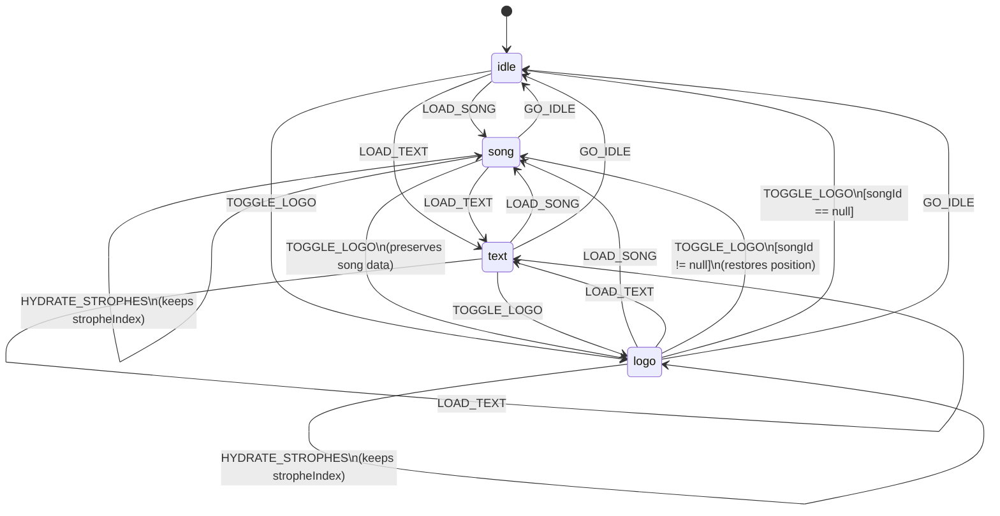
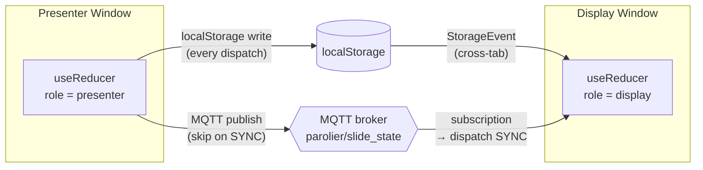

# Slide State Machine

## State Diagram

## Sync Layer

## Transition Table

| From \ Event   | LOAD_SONG       | LOAD_TEXT      | HYDRATE_STROPHES   | NEXT_STROPHE      | PREV_STROPHE       | GOTO_STROPHE      | TOGGLE_LOGO              | GO_IDLE   | SYNC      |
|----------------|-----------------|----------------|--------------------|-------------------|--------------------|-------------------|--------------------------|-----------|-----------|
| **idle**       | → song          | → text         | no-op              | no-op             | no-op              | no-op             | → logo (no song)         | no-op     | → any     |
| **song**       | → song (reset)  | → text         | fills strophes†    | stropheIndex + 1  | stropheIndex - 1   | jump to index     | → logo (preserves song)  | → idle    | → any     |
| **logo**       | → song          | → text         | fills strophes†    | no-op             | no-op              | no-op             | → song* or → idle**      | → idle    | → any     |
| **text**       | → song          | → text         | no-op              | no-op             | no-op              | no-op             | → logo (no song)         | → idle    | → any     |

\* TOGGLE_LOGO from `logo` → `song` when `songId !== null` (restores previous position)
\** TOGGLE_LOGO from `logo` → `idle` when `songId === null` (no song to restore)
\† HYDRATE_STROPHES only applies when `songId` matches the state's (a late fetch for
another song is ignored); mode, `setlistContext` and `stropheIndex` are preserved, the
index clamped to the fetched strophes

## State Details

### `idle`
- Initial state, nothing displayed
- Shows the cross/logo on screen

### `song`
- A song is loaded and displayed
- Fields: `songId`, `stropheIndex`, `strophes[]`, `setlistContext?`
- NEXT/PREV/GOTO_STROPHE navigate within the strophes array (clamped to bounds)
- LOAD_SONG always resets `stropheIndex` to 0 (even if same song)
- `strophes[]` is empty right after a sync — HYDRATE_STROPHES fills it in place

### `logo`
- Cross/logo is displayed over the current content
- Fields: `songId?`, `stropheIndex`, `strophes[]`, `setlistContext?`
- Preserves the underlying song data so toggling back restores exact position
- If entered from `idle` or `text`, `songId` is `null`

### `text`
- A non-song setlist item (reading, prayer, etc.) — shows the cross
- Fields: `textTitle`, `setlistContext`
- No strophe navigation — arrow keys trigger setlist step navigation instead

## Sync Details

- **localStorage**: every dispatch serializes a `SyncPayload` — syncs tabs in the same browser
- **MQTT** (`parolier/slide_state`): presenter publishes, display subscribes — syncs across devices
- **`strophes[]` is NOT serialized** — each window fetches its own song data from Supabase
- **SYNC events don't re-publish** — prevents infinite echo loops
- **A window filling in those missing strophes must dispatch `HYDRATE_STROPHES`, never
  `LOAD_SONG`.** `LOAD_SONG` means "start this song from the top", so it moves the slide the
  window just synced to — and since every dispatch is broadcast, the other window follows.
  That's how opening the display mid-song used to yank both windows back to slide 1.
  `LOAD_SONG` is for explicit navigation only: a URL, a picker, a setlist step.
